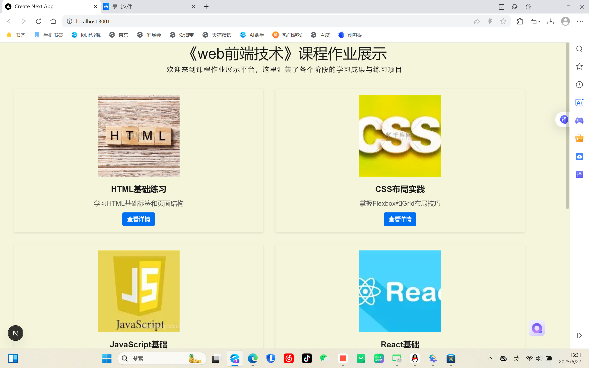
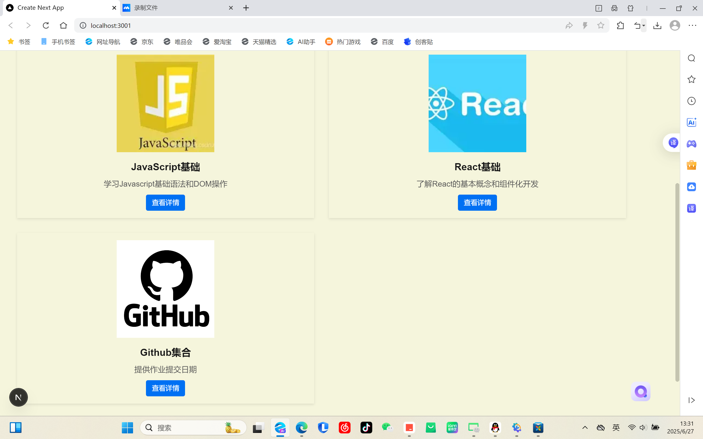
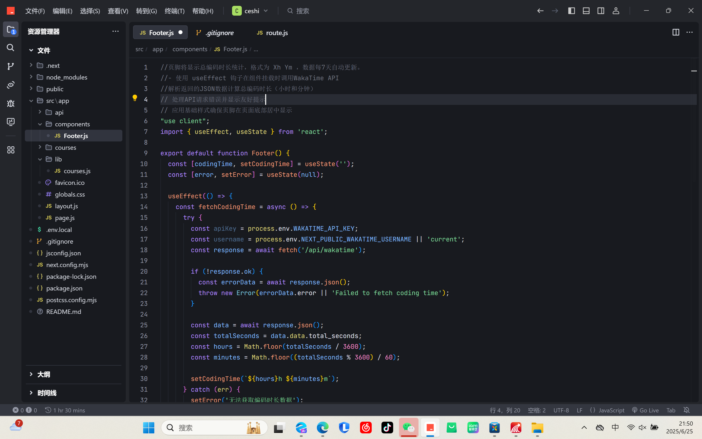
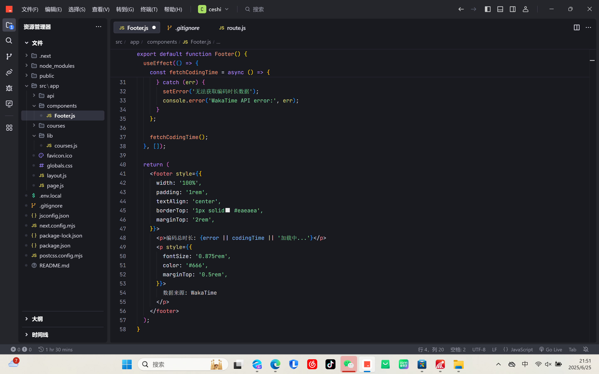
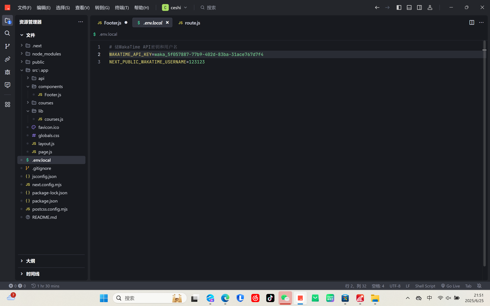

This is a [Next.js](https://nextjs.org) project bootstrapped with [`create-next-app`](https://github.com/vercel/next.js/tree/canary/packages/create-next-app).

## Getting Started

First, run the development server:

```bash
npm run dev
# or
yarn dev
# or
pnpm dev
# or
bun dev
```

Open [http://localhost:3000](http://localhost:3000) with your browser to see the result.

You can start editing the page by modifying `app/page.js`. The page auto-updates as you edit the file.

This project uses [`next/font`](https://nextjs.org/docs/app/building-your-application/optimizing/fonts) to automatically optimize and load [Geist](https://vercel.com/font), a new font family for Vercel.

## Learn More

To learn more about Next.js, take a look at the following resources:

- [Next.js Documentation](https://nextjs.org/docs) - learn about Next.js features and API.
- [Learn Next.js](https://nextjs.org/learn) - an interactive Next.js tutorial.

You can check out [the Next.js GitHub repository](https://github.com/vercel/next.js) - your feedback and contributions are welcome!

## Deploy on Vercel

The easiest way to deploy your Next.js app is to use the [Vercel Platform](https://vercel.com/new?utm_medium=default-template&filter=next.js&utm_source=create-next-app&utm_campaign=create-next-app-readme) from the creators of Next.js.

Check out our [Next.js deployment documentation](https://nextjs.org/docs/app/building-your-application/deploying) for more details.

## 运行截图

  
 
 
 
 
 

## 项目简介

本项目是一个基于Next.js的课程作业展示平台，它使用了QAnything和Wakatime API来实现课程作业的展示和时间统计功能。

## QAnything集成路径与实现细节

  1.集成路径
选择了路径1“你可以直接在Next.js应用中通过iframe嵌入或其他方式链接到QAnything提供的现有HTML问答页面。
”引入 JS 脚本：通过<script>标签引入 QAnything 的 JS 库，该库负责加载聊天界面 iframe</script>
配置参数：通过data-*属性设置聊天窗口的外观和行为
DOM 挂载：脚本会在页面加载后自动创建聊天按钮和 iframe 组件

3.样式定制
目前使用了系统默认样式，如需自定义可通过以下方式：

4.修改图标 URL 参数替换默认图标
通过 CSS 覆盖默认样式（需要注意样式优先级）
联系 QAnything 客服获取高级定制选项


## Wakatime API集成路径与实现细节
在项目根目录创建 .env.local（本地开发）或 .env.production（生产环境）。
在 .env 文件中添加以下内容：
WAKATIME_API_KEY=your_api_key
请将 `your_api_key` 替换为你自己的 API 密钥。   

## Next.js集成路径与实现细节

1. 项目架构与布局系统**
- **全局布局**：使用Next.js 13的App Router架构，在`app/layout.js`中定义全局布局，包含：
  - 导入Google字体（Geist Sans和Geist Mono）并应用于整个项目
  - 在每个页面底部注入`<Footer />`组件
  - 设置HTML语言属性和元数据（标题、描述）
- **页面组件**：`pages/NewPage.jsx`作为具体页面，展示课程列表内容


2. 第三方服务集成（QAnything客服系统）**
- **集成方式**：通过在页面中直接嵌入`<script>`标签引入QAnything客服系统
- **关键参数**：
  - `data-agent-src`：指定客服机器人的共享链接
  - `data-default-open`：控制是否默认展开聊天窗口
  - `data-drag`：允许用户拖动客服窗口位置
  - `data-open/close-icon`：自定义打开/关闭状态的图标
- **加载策略**：使用`defer`属性确保脚本在DOM加载完成后执行，避免阻塞页面渲染


3. 组件与数据流程**
- **核心组件**：
  - `Image`（Next.js优化的图片组件）
  - `Link`（客户端路由跳转）
  - `Footer`（全局页脚组件）
- **数据来源**：从`./lib/courses`模块导入课程数据，用于渲染课程列表
- **动态路由**：通过`Link`组件实现课程详情页的路由（如`/courses/[slug]`）


4. 样式与布局实现**
- **内联样式**：大量使用JSX内联样式（如`style={{...}}`）控制元素外观
- **布局结构**：
  - 页面整体采用居中对齐设计
  - 课程列表使用flexbox布局实现响应式排列
  - 卡片组件包含图片、标题、描述和操作按钮
- **视觉效果**：
  - 背景色：#f5f5dc（米黄色）
  - 主色调：#0070f3（蓝色按钮）
  - 卡片阴影：`box-shadow: 0 2px 5px rgba(0,0,0,0.1)`